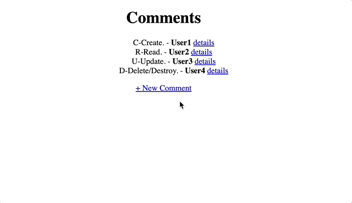

# RESTful Comments Section

The simulated comment section is built with **RESTful** routes and it implements **CRUD** functionality. Users can add new comments, modify existing ones, and delete unwanted comments.

## 🎉 Demo 




## ✨ What I Have Learned

**REST** (Representational States Transfer) uses the HTTP protocol’s request types (`POST`, `GET`, `PUT`/`PATCH`, and `DELETE`) to allow users to **C**reate, **R**ead, **U**pdate, **D**estroy/**D**elete (**CRUD**) via an API. The main idea of **REST** is treating data on the server-side as recources that can be CRUDed and making them easy to consume.

5 HTTP Methods:

`GET`: performs the read operation on data.

`POST`: creates a new resource in our database.

`PUT`: the client sends the entire updated object.

`PATCH`: the client sends only the modified part of the object.

`DELETE`: deletes resources (the client usually must be authenticated to perform DELETE).


## 💻 Setup

1️⃣ Run the command below to install packages used in the project:
```sh

$ npm install

```
2️⃣ Install nodemon globally so that it'll restart the application when changes are made to the project:
```sh

$ npm install -g nodemon

```


3️⃣ Run `nodemon index` in the terminal to start the server, and connect to `http//localhost:3000` in the web browser.
## 👏 Credits

This project is based on the <a href="https://getbootstrap.com/docs/4.6/getting-started/introduction/">Bootstrap Documentation<a/> and the REST tutorial of <a href="https://www.udemy.com/course/the-web-developer-bootcamp/">The Web Developer Bootcamp</a> by Colt Steele.
